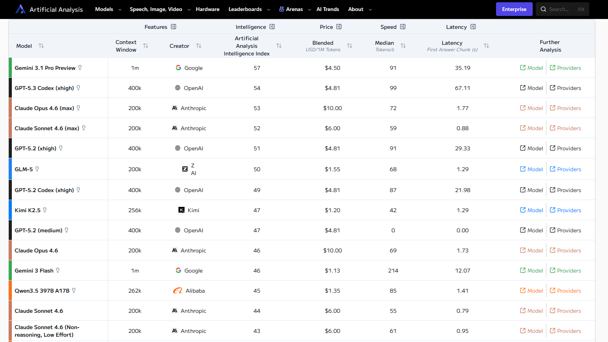
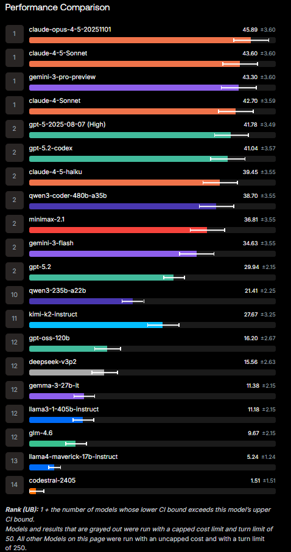

# The Edge of Intelligence

**The Edge of Intelligence — Why Open-Weight AI Will Move from Cloud to Your Device, and What It Means for Business and Society**

  

---

## Part 1: The Convergence

### — Structural Evidence That the Performance Gap Has Vanished

 

> **The question this chapter asks:**
> When open-weight models match proprietary models in performance, what exactly are you paying for?

 

### 1-1. What Happened in Eight Weeks of 2026

Between January and February 2026, ten major open-weight LLM architectures were released in the span of just eight weeks. 
"Open-weight" refers to AI models whose core trained parameters — the "weights" — are publicly available, allowing anyone to download and run them in their own environment. 

The opposite is a "proprietary model" — like GPT or Claude — developed and operated behind closed doors by a company, accessible to users only through APIs. 

Start with the numbers. 
The table below shows the performance profiles of the latest open-weight LLMs as of their release.

| Model             | Total Parameters | Active Parameters | Performance Level                                   |
|:----------------- |:---------------- |:----------------- |:--------------------------------------------------- |
| GLM-5             | 744B             | 40B               | On par with GPT-5.2 xhigh and Claude Opus 4.6  |
| Kimi K2.5         | 1T               | 32B               | Frontier-class at launch                            |
| Step 3.5 Flash    | 196B             | 11B               | Surpasses DeepSeek V3.2 (671B), 3× throughput   |
| Qwen3-Coder-Next  | 80B              | 3B                | Approaches Claude Sonnet 4.5 on SWE-Bench Pro   |
| MiniMax M2.5      | 230B             | N/A               | #1 open-weight model by usage on OpenRouter     |
| Nanbeige 4.1 3B   | 3B               | 3B (dense)        | Dramatically surpasses same-size models from one year prior |

※ B = Billion, T = Trillion

The data above draws primarily from Sebastian Raschka's "A Dream of Spring for Open-Weight LLMs" (February 25, 2026), corroborated by independent benchmarks including AI Index (artificialanalysis.ai), the Vectara Hallucination Leaderboard, and SWE-Bench Pro.

Ten architectures in eight weeks. That pace alone is extraordinary.

But the real significance is not the volume.

**Open-weight models are pushing the frontier of efficiency in multiple directions simultaneously.** One optimizes for inference speed. Another for memory efficiency. Another for coding ability. Each is attacking the walls of proprietary models from a different angle. 

And the walls have already fallen.

 

### 1-2. The Lie of "The Gap Is Narrowing"

Many media outlets and industry reports still write something like this: 

*"The performance gap between open-source models and proprietary models is narrowing."* 

As of spring 2026, **this statement is no longer accurate.** The precise formulation is: 

**"On benchmarks, the performance gap has already vanished."** 

GLM-5 has recorded scores on par with GPT-5.2 extra-high and Claude Opus 4.6 across multiple independent benchmarks. 
Kimi K2.5 matched frontier models at launch. 
Step 3.5 Flash surpassed DeepSeek V3.2 — a model with more than three times its parameter count — while delivering 3× the inference throughput. 

These are not predictions about what might happen eventually. **They are already observed facts.** 

An important distinction must be made here. The vanishing of the benchmark gap is not the same as the value of proprietary model APIs dropping to zero. 
Understanding this difference precisely is the heart of Part 1 and the departure point for everything that follows.

 

### 1-3. Three Pieces of Evidence for Performance Convergence

To justify the claim that performance has "converged," let us examine the evidence from three distinct angles.

#### Evidence ① — Convergence in Composite Benchmarks

AI Index (artificialanalysis.ai) is an independent benchmark that evaluates LLM performance across multiple dimensions. 
As of February 2026, its data clearly shows that the scores of top-tier open-weight models and proprietary models no longer exhibit statistically significant differences. 

The top of this leaderboard was once dominated by GPT, Claude, and Gemini. 
Now, GLM-5, Kimi K2.5, and MiniMax M2.5 sit right beside them.

*Source: Artificial Analysis Intelligence Index, as of February 2026. Red boxes indicate open-weight models.
GLM-5 (score 50) is within 1 point of GPT-5.2 xhigh (51); Kimi K2.5 (47) matches GPT-5.2 medium (47).
Pricing: GLM-5 at $1.55, Kimi K2.5 at $1.20 — less than one-third of proprietary model pricing.*

 

#### Evidence ② — Convergence in Hallucination Rates

The Vectara Hallucination Leaderboard independently measures how often a model "lies" — that is, produces outputs that contradict factual information. 
This data addresses the critique that even if benchmark scores are similar, a model is useless in practice if it hallucinates frequently. 

*Source: Vectara Hallucination Leaderboard (HHEM-2.3), as of January 30, 2026. Of the top 25, only two are proprietary: OpenAI GPT-4.1 (#15) and Google Gemini 2.5 Pro (#21).*

On this leaderboard as well, open-weight models have reached a level indistinguishable from their proprietary counterparts. The argument that "they match on benchmarks but fall short in practice" is refuted by the data.

 

#### Evidence ③ — Convergence in Coding Ability

SWE-Bench Pro is a benchmark that uses real-world software engineering tasks to measure whether an LLM can actually write code. Unlike academic knowledge tests, it directly reflects practical capability.

*Source: SWE-Bench Pro Public Leaderboard (SEAL, Scale AI), as of February 2026. The open-weight model qwen3-coder-480b-a35b (38.70%) is within 0.75 points of Claude 4.5 Haiku (39.45%), sharing Rank 2. minimax-2.1 (36.81%) and kimi-k2-instruct (27.67%) also place on the leaderboard.*

Qwen3-Coder-Next matches Claude 4.5 Haiku at essentially Rank 2 on this benchmark, outscoring GPT-5.2. 
It does this with 80B total parameters — only 3B of which are active during inference. This means coding capability comparable to Claude Sonnet 4.5 is being achieved at a fraction of its infrastructure cost. 

Across three distinct evaluation dimensions — composite performance, factual accuracy, and practical task execution — open-weight models have closed the gap with proprietary models. To describe this as "narrowing" is, at this point, a diminishment of reality.

 

### 1-4. Why Ten Architectures Appeared Simultaneously in Eight Weeks

Answering this question is the key to understanding the true nature of convergence.

The answer is not simple, but it can be explained structurally.

**Reason ① — The Democratization of Scaling Laws**

Scaling laws — the empirical finding that model performance improves predictably as compute and data increase — were once a "secret formula" that only a handful of giant AI companies could put into practice. The fact that Anthropic's founder, Dario Amodei, became convinced of these laws during his time at OpenAI is central to his intellectual foundation (for a detailed analysis, see the author's *The Silence of Intelligence — The Philosophy of Dario Amodei*).

Between late 2025 and early 2026, however, scaling laws became common engineering knowledge. The accumulation of academic papers, technical reports, and open-source community insights created an environment where anyone with sufficient compute and a talented team could train a frontier-class model.

Frontier-level performance has become a reproducible engineering achievement.

**Reason ② — The Maturation of Mixture-of-Experts (MoE)**

Several of the ten architectures employ MoE — a technique that dramatically reduces the portion of a model's total parameters that are actually used during inference (the "active parameters").

Qwen3-Coder-Next has 80B total parameters but activates only 3B during inference. GLM-5 has 744B total parameters with only 40B active. In effect, these models retain the "knowledge of a giant model" while running at the "cost of a small model."

The implications run deep. Performance can be maintained while compressing the compute required for inference by more than 10×. This technical breakthrough is what made simultaneous performance convergence and an efficiency revolution possible.

**Reason ③ — A Shift in Global Competitive Structure**

Look at where the ten architectures were developed, and the geographic diversity is striking. China (GLM-5, Kimi K2.5, Qwen3-Coder-Next, Nanbeige, Step, MiniMax), the United States (Arcee AI), and the global open-source community.

Chinese-origin models are particularly dominant. This signals a structural shift in technological hegemony within AI development. The era in which a handful of American companies defined the frontier is over.

The geopolitical implications are beyond the scope of this book, but one point must be made:
**When frontier AI development is no longer the monopoly of any single nation or company, the foundational assumptions of AI strategy itself are rewritten.** The era of agonizing over "which API vendor to choose" is drawing to a close.

 

### 1-5. What Value Remains in Proprietary APIs?

In a world where the performance gap has vanished, why do companies continue to pay tens of thousands of dollars a month for GPT-5.2 or Claude Opus 4.6 APIs?

The honest answer is not a "performance premium" but a **"reliability premium."**

Let us precisely decompose the real value that proprietary APIs provide.

**① SLA (Service Level Agreement)**

A guaranteed 99.9% API uptime. Support infrastructure for outages. Dedicated account managers for enterprise clients.
These have nothing to do with "model performance" — they are operational peace of mind.

**② Instant Access**

Immediate access to the latest models. No infrastructure buildout required. One line of API code to access state-of-the-art intelligence.
This remains especially valuable for small and medium-sized businesses that lack the resources to build their own GPU infrastructure.

**③ Safety Measures and Governance**

Safety layers such as Anthropic's Constitutional AI and OpenAI's Content Policy.
If a company runs an open-weight model on its own infrastructure, it must build these safety layers in-house. The cost and expertise required are non-trivial.

**④ Ecosystem and Integration**

Ecosystems like Anthropic's Cowork and MCP (Model Context Protocol), OpenAI's GPTs, and Google's Vertex AI. The surrounding tooling for integrating AI into existing business workflows is a competitive axis independent of model performance.

All four of these sources of value are paid for **not because "the model is superior" but because "the service is superior."**

This distinction is critically important.
Because the price enterprises pay for proprietary APIs used to be "performance premium + reliability premium." From spring 2026 onward, it has become **purely a reliability premium.**

With the performance premium gone, the CFO's equation changes.
The question shifts from "what does it cost to use the best model" to "how much per month is operational peace of mind worth?" And this question always has a threshold. The moment the reliability premium exceeds a certain amount, the enterprise concludes: "It's cheaper to run it ourselves."

That crossover point is approaching fast.

 

### 1-6. What the Democratization of Scaling Laws Means

Scaling laws, put simply, are the empirical observation that "increasing compute and data improves model performance in a predictable manner."

When this law was locked inside a few AI companies, frontier AI was effectively an oligopoly. OpenAI, Anthropic, and Google monopolized the supply of the world's most advanced intelligence.

But the fact that ten open-weight architectures appeared simultaneously in eight weeks means that scaling laws have **proliferated as reproducible engineering knowledge.**

A historical analogy is instructive.

In the semiconductor industry, Intel was once the only company capable of state-of-the-art process miniaturization. But as manufacturing technology matured and TSMC and Samsung caught up — and eventually overtook it — "being able to fabricate the most advanced chip" ceased to be a differentiator. **The axis of differentiation shifted from manufacturing process to "design philosophy" and "application specialization."**

Exactly the same structural shift is now occurring in the world of LLMs.

"Being able to train a state-of-the-art model" is no longer a differentiator. The axis of differentiation is moving to **"where inference is executed" and "how data is structured."**

This structural shift is precisely what the title of this book — "The Edge of Intelligence" — points to.
The locus of value is migrating from inside the model to outside the model — to where inference happens, how data is structured, and where users interact with intelligence.

 

### 1-7. Conclusions of This Chapter

Let us summarize the facts established in Part 1.

* **Fact 1:** In eight weeks spanning January–February 2026, ten major open-weight LLM architectures were released.

* **Fact 2:** These models no longer show statistically significant performance differences from proprietary models such as GPT-5.2, Claude Opus 4.6, and Gemini Pro 3 across multiple independent benchmarks (AI Index, Vectara Hallucination Leaderboard, SWE-Bench Pro).

* **Fact 3:** This convergence is driven by three structural factors: the democratization of scaling laws, the maturation of MoE architecture, and a shift in global competitive dynamics.

* **Fact 4:** The residual value of proprietary APIs is not a "performance premium" but a "reliability premium" — and the economic rationality of that premium has a crossover point.

* **Fact 5:** The axis of differentiation is shifting from "model performance" to "inference location" and "data structuring."

These facts point to a single question:

> **Now that open-weight models have matched proprietary models in performance, where is the next frontier of competition?**

Part 2 explores that answer.

 

---

## Part 2: The New Battleground

### — Efficiency, Speed, and On-Device: The New Axes of Competition

 

> **The question this chapter asks:**
> When equivalent intelligence runs on your device at 3× the speed and zero marginal cost, why would you keep sending your data to someone else's server?

 

### 2-1. What Comes After Performance

As established in Part 1, the benchmark performance gap has already vanished. 

So what becomes the next axis of competition? 
The answer is already embedded in the ten architectures released in spring 2026. The fact that each model optimizes not for "performance" but for a different dimension of "efficiency" tells the story of where competition has moved. 

| Model             | Optimization Target       | Concrete Achievement                                         |
|:----------------- |:------------------------- |:------------------------------------------------------------ |
| Step 3.5 Flash    | Inference throughput       | 100–300 tok/sec (peak 350), retaining 196B knowledge with 11B active |
| Qwen3-Coder-Next  | Minimal active parameters  | Only 3B of 80B active, Rank 2 territory on SWE-Bench Pro     |
| Nanbeige 4.1 3B   | On-device feasibility      | 3B dense model, demonstrated local inference on smartphone   |
| GLM-5             | Cost efficiency            | Frontier-class performance at $1.55/1M tokens (1/3 of GPT-5.2) |
| Kimi K2.5         | Knowledge density          | 32B active from 1T total parameters, $1.20/1M tokens        |

What this table reveals is that the competition over "who is smartest" has ended, and a new competition has begun: **"How fast, cheap, small, and close to the user can you run the same intelligence?"** 

This chapter deconstructs this new competition across four axes.

 

### 2-2. Axis ①: Inference Efficiency — How Many Tokens Per Dollar?

When performance is equivalent, the decisive factor is **inference efficiency** — how many output tokens can be generated per dollar of compute. 
This metric determines the economics of "continuing to use" AI.

Step 3.5 Flash stands out on this axis. 
Of its 196B total parameters, only 11B are active during inference. Of 288 expert modules, only the top 8 are selected for each token. This "sparse activation" allows the model to retain a 196B knowledge base while running inference at the speed of an 11B model. 

Furthermore, a technique called 3-way Multi-Token Prediction (MTP-3) predicts four tokens simultaneously in a single forward pass. This is what achieves a peak inference speed of 350 tokens per second on NVIDIA Hopper GPUs. 

Let us translate these numbers into business terms. 

Conventional frontier models (such as Claude Opus 4.6 or GPT-5.2) require several times more compute to process the same task. Step 3.5 Flash delivers comparable inference quality at a fraction of the cost. This means the volume of tasks a company can process on the same budget increases by more than 3×. 

Or from the inverse perspective: the GPU budget required for the same task volume drops to one-third. 

The implications of this efficiency revolution are profound. Frontier-class AI inference was once a cost that only large enterprises could bear. The dramatic improvement in inference efficiency extends frontier-grade intelligence to small businesses and individual developers.

When the cost of intelligence falls low enough, the debate over "whether to use AI" ends. It becomes economically rational to embed AI inference into every business process, every piece of software, every device.

 

### 2-3. Axis ②: On-Device Feasibility — Intelligence Descends to Your Hands

The most dramatic consequence of improved inference efficiency is the reality that **frontier-class intelligence can leave the cloud and run on personal devices.** 

Nanbeige 4.1 3B is the model that symbolizes this tipping point. 
With a mere 3 billion parameters in a dense (non-MoE) architecture, it outperformed same-size models from one year prior — and even surpassed Qwen3-32B, a model with more than 10× its parameter count, on multiple benchmarks. 

But more important than benchmark scores is this: **this model runs on a smartphone.** 

The 4-bit quantized Nanbeige 4.1 3B requires neither a GPU nor a cloud connection. One developer successfully had it solve university-level differential equations on a smartphone — correctly processing classical mechanics problems and executing multi-step reasoning without breaking down. This means that the same class of capability previously available only through cloud-connected frontier models has been realized in a pocket-sized device.

Step 3.5 Flash also demonstrates on-device potential. While its 196B total parameters are massive, StepFun officially supports local inference on high-end workstations including Apple M4 Max, NVIDIA DGX Spark, and AMD AI Max+ 395. An edge inference engine using llama.cpp is officially integrated, guaranteeing operation in a "100% trusted execution environment." 

Let us calibrate our sense of the timeline:

| Execution Environment       | Status as of Spring 2026    | Model Class                                                 |
|:--------------------------- |:--------------------------- |:----------------------------------------------------------- |
| High-end workstation         | **Already production-ready** | 196B MoE (Step 3.5 Flash), 744B MoE (GLM-5)               |
| Laptop (M4 Max, etc.)       | **Already operational**      | 80B MoE (Qwen3-Coder-Next), 3B dense (Nanbeige 4.1)       |
| Smartphone                   | **Technically demonstrated** | 3B dense (Nanbeige 4.1, 4-bit quantized)                   |
| IoT / Embedded devices       | Research stage               | Sub-1B models                                               |

In early 2025, "running frontier-class AI locally" was closer to a technical fantasy. By spring 2026, it is **already production-ready** on workstations and laptops. On smartphones, technical feasibility has been demonstrated. 

The remaining question is not "when will it become practical" but "when will it become the default." 

And the answer to that question should be measured not in years but in quarters. Given the pace of MoE architecture and quantization advances, the probability of commercial-grade frontier inference on smartphones by the end of 2026 is far from negligible.

 

### 2-4. Axis ③: Architectural Innovation — The Technologies Enabling "Same Intelligence, Less Compute"

On-device inference is not enabled by any single breakthrough. **Multiple architectural innovations matured simultaneously**, and their convergence is what has made this shift inevitable. 

Let us catalog the key innovations.

**① Mixture-of-Experts (MoE) — Efficiency Through Sparse Activation**

MoE, outlined in Part 1, has become the foundational architecture adopted by the majority of open-weight models released in spring 2026. 

The core idea is simple: instead of using all of a model's parameters at once, selectively activate only the "experts" most relevant to each token. In Step 3.5 Flash, only the top 8 of 288 expert modules are selected per token. The result: inference with the knowledge of a 196B model at the compute cost of an 11B model. 

This divergence between "total parameters" and "active parameters" is the single most important technical factor making on-device inference a reality.

**② Multi-Token Prediction (MTP) — Breaking the Sequential Processing Barrier**

Conventional LLMs generate tokens one at a time, sequentially. This is the bottleneck for inference speed. 

Step 3.5 Flash's MTP-3 predicts four tokens simultaneously in a single forward pass, then verifies them in parallel. This breaks through the sequential decoding barrier and dramatically increases throughput. 

The significance of MTP is not merely that it is "fast." **Faster inference enables real-time interaction.** Chatbots are designed for "reading"; agents — AI that autonomously executes tasks — are designed for "thinking and acting." Agents require response latency that humans can tolerate, and MTP meets that requirement.

**③ Sliding Window Attention (SWA) — A Cost Revolution for Long-Document Processing**

Standard Transformer attention mechanisms incur compute costs proportional to the square of the input length (O(n²)). As documents grow longer, costs explode. 

SWA restricts each token's attention to a fixed-length window (e.g., 512 tokens), reducing compute to O(n·t), where n is the input length and t is the window size. Step 3.5 Flash mixes full attention with SWA at a 3:1 ratio, efficiently processing a 262K-token context window. 

In on-device inference, memory is the most precious resource. SWA enables practical handling of long contexts on limited memory, underpinning real-world on-device AI experiences — summarizing long documents, editing code across multiple files, and sustaining extended conversations.

**④ Quantization — Controlling the Precision-Size Tradeoff**

Quantization converts model parameters from standard 32-bit or 16-bit floating-point to lower-precision representations such as 8-bit or 4-bit. 

The 4-bit quantized version of Nanbeige 4.1 3B operates in roughly one-quarter of the original model's memory footprint. This means a 3B-parameter model can run in approximately 2 GB of memory — which is what makes local inference on a smartphone with 8 GB of RAM a reality. 

Each of these four innovations developed independently, but all matured "simultaneously" in spring 2026. Their convergence is what has made the once-impossible — frontier-class intelligence running at the edge — now possible.

 

### 2-5. Axis ④: Privacy and Data Sovereignty — The Structural Advantage of "Not Sending"

The final axis concerns not technology but the structure of human life and society. 

Cloud AI is fundamentally predicated on "sending your data to someone else's server." Every piece of text you enter into ChatGPT or Claude — your company's confidential information, questions about your health, consultations about family problems — travels across the internet and is processed on another company's infrastructure. 

No matter how robust the privacy policy, the fact that data "physically moves" does not change. 

On-device inference rewrites this structure at its root. **Data is processed where it is generated and never leaves the device.** This is not a technical security measure — it is a physical guarantee. 

Let us examine what this "physical guarantee" means from the perspectives of both enterprises and individuals.

**For enterprises — Structural reduction in regulatory compliance costs**

The GDPR imposes strict restrictions on transferring personal data outside the EU. Financial industry regulations on data processing locations grow stricter every year. Healthcare remains deeply resistant to cloud processing of patient data. 

To comply, enterprises bear enormous costs: complex data processing agreements with cloud AI providers, periodic compliance audits, region-specific data center deployments. 

On-device inference — or more precisely, running open-weight models on-premise or in a private cloud — structurally eliminates the bulk of these costs. If data never leaves your own infrastructure, data transfer regulations simply do not apply.

**For individuals — A place to ask what you wouldn't want others to hear**

Consider what people ask AI. 

"Is this symptom serious?" — health anxiety. 
"I'm considering a divorce" — family distress. 
"Should I change careers?" — career uncertainty. 
"Is there any way to pay off my debts?" — financial hardship. 

These are questions where people need help the most — and want it known the least. Entering them into a cloud AI means, in principle, that this information traverses the internet and arrives at another company's servers. 

Of course, major AI providers promise safe data handling. Encryption, data retention policies, privacy certifications. 

But as discussed in 2-5, **the gap between "it is being managed securely" and "it was never sent in the first place" is psychologically unbridgeable.** 

On-device AI physically closes this gap. Your questions are processed inside your device and go nowhere. This sense of security is far more intuitive and powerful than pages of privacy policy fine print. 

Apple Intelligence's decision to place on-device processing at the core of its strategy reflects a precise reading of this human instinct. Apple chose to differentiate on "where" AI runs rather than "how well." The analysis in this book vindicates that choice.

 

### 2-6. The Single Direction All Four Axes Point To

Let us survey the four axes analyzed so far.

| Axis              | Essence of Competition        | Where We Stand in Spring 2026                              |
|:----------------- |:----------------------------- |:---------------------------------------------------------- |
| ① Inference Efficiency | Processing capacity per dollar | Frontier-class at less than 1/3 of previous cost          |
| ② On-Device        | Where inference executes       | Workstation = production-ready; Smartphone = demonstrated  |
| ③ Architecture     | Same intelligence, less compute | Simultaneous maturation of MoE, MTP, SWA, Quantization   |
| ④ Privacy          | The value of data not moving   | Regulatory cost reduction + psychological security         |

The four axes appear to be independent competitive domains. 
But all point in **the same direction.** 

That direction is: **"Intelligence is moving from the cloud to where the user is."** 

The improvement in inference efficiency means intelligence can run without massive GPU clusters in the cloud. 
The maturation of on-device technology proves that intelligence can run on smartphones and laptops. 
Architectural innovation makes this migration technically possible. 
And the demand for privacy makes this migration socially **inevitable.** 

Technology makes it "possible." Economics makes it "rational." Society makes it "necessary." 

When these three forces converge in the same direction, the resulting flow becomes **structurally irreversible.** 

The careful reader may ask: Is "irreversible" really true? Could cloud AI reclaim a decisive advantage? 

The honest answer: Cloud AI will not disappear. As established in Part 1, proprietary APIs retain a rational value in the form of "reliability premiums." But the era in which cloud AI was **the only option** is already over. 

The history of AI can be described as a pendulum between "centralization" and "distribution." From mainframes to PCs. From PCs to the cloud. And now, from cloud to the edge. This pendulum swings toward distribution every time compute becomes sufficiently cheap. In spring 2026, that condition has been met — through the performance convergence and efficiency revolution of open-weight models.

 

### 2-7. Conclusions of This Chapter

Let us summarize the facts established in Part 2.

* **Fact 1:** After performance convergence, the axes of competition have shifted to "inference efficiency," "on-device feasibility," "architectural innovation," and "privacy / data sovereignty."

* **Fact 2:** Step 3.5 Flash achieves 100–350 tok/sec inference speed with only 11B active parameters, rewriting the frontier of inference efficiency.

* **Fact 3:** Nanbeige 4.1 3B has technically demonstrated frontier-class local inference on a smartphone. As of spring 2026, on-device inference on workstations and laptops is already production-ready.

* **Fact 4:** Four architectural innovations — MoE, MTP, SWA, and quantization — have matured simultaneously, structurally enabling "same intelligence, less compute."

* **Fact 5:** The characteristic of on-device inference — that data physically never leaves the device — structurally reduces regulatory compliance costs for enterprises and provides fundamental peace of mind on privacy for individuals.

* **Fact 6:** Three forces — technological, economic, and social — are converging in the same direction: "the migration of intelligence from cloud to edge." This flow is structurally irreversible.

These facts lead to the next question:

> **When intelligence migrates from cloud to edge, how is enterprise AI strategy rewritten? And how does the consumer AI experience transform?**

Part 3 answers from the enterprise perspective; Part 4 from the consumer perspective.

 

---

## Part 3: Enterprise Implications

### — Five Structural Shifts That Rewrite Enterprise AI Strategy

 

> **The question this chapter asks:**
> Your AI strategy was built on the assumption that proprietary models are superior. Now that this assumption is invalid, what changes?

 

### 3-1. What the Collapse of Assumptions Brings

Part 1 established the fact that the benchmark performance gap has vanished. 
Part 2 analyzed how the axes of competition have shifted to efficiency, on-device, and privacy. 

Here, we confront a single question: 

**What specific changes does this structural shift impose on enterprise AI strategy?** 

Companies around the world formulated their AI strategies between 2023 and 2025. The vast majority of those strategies rest, implicitly, on a single assumption: 

*"The smartest models are the proprietary models of OpenAI, Anthropic, and Google, and enterprises pay monthly fees to access their APIs."* 

This assumption was invalidated in spring 2026. 

The collapse of an assumption demands not a strategy revision but a **strategy redesign.** This chapter identifies five structural shifts that enterprises now face and analyzes the implications of each.

 

### 3-2. Shift ①: From "Which Model to Use" to "Where to Run Inference"

From 2024 through 2025, the central decision in enterprise AI was "which API vendor to choose." 

OpenAI or Anthropic? GPT-5 or Claude Opus 4.5? What are the contract terms? What's the SLA? 
AI strategy meetings were consumed almost entirely by vendor selection. 

In a world of converged performance, the importance of this question drops dramatically. 

Because whether you choose GLM-5, Kimi K2.5, or Qwen3.5, benchmark results are virtually identical. No matter which model you select, making a catastrophic mistake on "performance" has become structurally difficult. 

The question that rises to replace it is this: 

**"Where do we execute inference?"** 

This is not a technology question. It is a **business architecture question.** 

The choice of where inference executes simultaneously determines three things: 

* Where data resides (data residency)
* Who owns the inference output (intellectual property)
* Whether the cost structure is OpEx (variable) or CapEx (fixed) (financial architecture)

In other words, the decision of "where to run inference" simultaneously defines the enterprise's data governance, IP strategy, and financial structure. It is not only the CIO's problem — it is the CFO's, the CLO's (Chief Legal Officer), and the CEO's.

 

### 3-3. Shift ②: From OpEx (API Billing) to CapEx (Inference Infrastructure Investment)

Cloud API pricing is inherently an OpEx (operating expenditure) model. Pay per use. Monthly billing. Variable cost. 

This "pay per use" model contains cost structures that are easy to overlook. 

Lenovo's 2026 TCO (Total Cost of Ownership) analysis made this structure quantitatively explicit. On-premise GPU infrastructure reaches its **breakeven point in under four months** in high-utilization environments. Over a five-year lifecycle, savings exceed $5 million per server. In terms of per-token economics, on-premise infrastructure holds a **cost advantage of up to 18× over Model-as-a-Service APIs.** 

Let us think through a concrete scenario. 

Consider a company processing 10 billion tokens per month. Cloud API processing would cost tens to hundreds of thousands of dollars monthly. Processing the equivalent workload with an on-premise open-weight model — even amortizing the initial investment over 36 months — yields a dramatically lower per-token cost. 

However, an important caveat is necessary. 

**On-premise is not the optimal answer for every enterprise.** For companies with low monthly token volumes, highly variable workloads, or no team with GPU operations expertise, the flexibility of cloud APIs remains rational. 

The real question the CFO faces is not the binary of "cloud versus on-premise." It is the optimization problem: **"What workload placement minimizes TCO over 36 months?"** 

And the parameters of this calculation shift every quarter. Each time open-weight model efficiency improves, the on-premise breakeven point moves forward. The maturation of MoE architectures in spring 2026 is accelerating this shift.

 

### 3-4. Shift ③: Reassessing Vendor Lock-In Risk

In 2024, "depending on OpenAI's API" was a rational choice. 
Because OpenAI's models were clearly superior to alternatives. With no substitute, dependence was inevitable. 

As of spring 2026, that rationale has evaporated. 

GLM-5, Kimi K2.5, Qwen3.5 — all deliver virtually equivalent performance. And because they are open-weight, you can run them freely on your own infrastructure. No one holds the API key over you. No pricing revisions to absorb. No service outages to be disrupted by. 

In this context, the meaning of continued dependence on proprietary APIs changes. 

What was once **"an acceptable necessity"** 
now carries the risk of **"strategic negligence."** 

That said, we must faithfully invoke the argument from Part 1. Proprietary APIs retain rational value in "reliability premiums" — SLAs, enterprise support, safety layers, ecosystem. 

Therefore, the precise question is: 

**Is the amount you are currently paying a rational price for the "reliability premium"?** 

If you can handle equivalent workloads by running open-weight models on-premise, the differential is the "actual cost of the reliability premium." The CFO should calculate this actual cost explicitly and determine whether it is an amount worth paying. 

For many enterprises, this calculation has never been performed. Given that performance is now equivalent, "psychological comfort from using the best model" may be the only reason they're still choosing API access.

 

### 3-5. Shift ④: Building an Inference Location Portfolio

When Shifts ① through ③ are taken together, the core of enterprise AI strategy migrates to **optimizing the "Inference Location Portfolio."** 

Rather than entrusting everything to a single AI vendor, workloads are distributed across three tiers based on their characteristics. 

**Tier 1: Cloud API (Proprietary Models)**

* Use cases: Decisions demanding the highest accuracy, instant access to the latest models, experimental workloads
* Example models: Claude Opus 4.6, GPT-5.2
* Cost structure: OpEx (variable). High cost, high flexibility
* Best when: Launching new projects, benchmarking, workloads too small to justify CapEx

**Tier 2: On-Premise / Private Cloud (Open-Weight Models)**

* Use cases: Processing confidential data, regulatory compliance, predictable high-volume workloads
* Example models: GLM-5 (744B MoE), Qwen3.5 (397B MoE) class
* Cost structure: CapEx (fixed) + OpEx (operations). Per-token cost decreases as monthly volume increases
* Best when: Processing financial, medical, or legal data; GDPR-compliant EU-facing services; stable workloads exceeding 1 billion tokens per month

**Tier 3: Edge / On-Device (Compact Models)**

* Use cases: Real-time operations, offline environments, factories, retail, vehicles
* Example models: Nanbeige 4.1 3B class, quantized 7B–14B models
* Cost structure: Device CapEx only. Marginal cost of inference is near zero
* Best when: Factory quality inspection, in-store customer support, field operations with unstable connectivity, consumer services where privacy is paramount

Optimizing how much of which workload is allocated across these three tiers will become the **core competency of the AI strategist** going forward. 

Critically, this allocation is not static — it is **dynamic.** Each time open-weight model performance improves, migrating workloads from Tier 1 to Tier 2, and from Tier 2 to Tier 3, becomes more economically rational. The portfolio should be reviewed on a quarterly basis.

 

### 3-6. Shift ⑤: From Model Performance to Context Engineering

The fifth and final shift is the most fundamental. 

In a world where model performance has converged, where does differentiation between enterprises migrate? 

The answer lies **outside the model.** 

GLM-5, Kimi K2.5, and GPT-5.2 all return similar answers to the same question. But **the quality of the output changes dramatically depending on what context is provided to the model.** 

Consider a scenario where you instruct AI to "forecast next quarter's revenue." 

No matter how intelligent the model, if your company's historical sales data, customer segment trends, competitive dynamics, macroeconomic indicators, and sales pipeline information are not structured as context, the AI's output will be generic and unremarkable. 

Conversely, if these data are properly structured and efficiently injected into the model's context window, even a small 7B model can deliver more accurate answers than GPT-5.2 without context. 

**In other words, competitive advantage has migrated from inside the model to outside it.** 

This structure aligns precisely with Palantir's ontology strategy. 

Palantir does not develop its own LLMs. What they build is a platform that organizes enterprise data into an "ontology" — a semantically structured data model — enabling LLMs to leverage that data to its fullest. The model is the commodity. Data structuring is the competitive advantage — that is Palantir's bet, and the reality of spring 2026 proves the bet was correct (for details, see the author's *Palantir Ontology Strategy*). 

In the context of this book, we call this shift **"Context Engineering."** 

Context Engineering is the discipline and practice of designing and optimizing the input data provided to models — internal documents, customer data, structured representations of business processes. 

In the language of the Depth & Velocity (D&V) methodology proposed by the author: 

* **Depth once referred to model performance. That has been democratized.**
* **The new Depth is the structuring of your organization's proprietary data and context.**

"Depth" in the sense of model performance has been made accessible to everyone through open-weight models. The new "Depth" — the structuring of your company's data and domain knowledge, which no competitor can replicate — is the only remaining source of differentiation in AI.

 

### 3-7. Conclusions of This Chapter

Let us summarize the five structural shifts identified in Part 3.

* **Shift 1:** The central enterprise AI decision has migrated from "which model to use" to "where to execute inference." This is a business architecture question that simultaneously determines data governance, IP strategy, and financial structure.

* **Shift 2:** The cost structure is shifting from OpEx (API billing) to CapEx (inference infrastructure investment). The on-premise breakeven point is moving forward with every passing quarter.

* **Shift 3:** Dependence on proprietary APIs has transformed from "an acceptable necessity" to "a risk of strategic negligence." Enterprises should explicitly calculate the "actual cost of the reliability premium."

* **Shift 4:** In place of single-vendor dependence, enterprises must build a three-tier "Inference Location Portfolio" (Cloud API / On-Premise / Edge) and dynamically optimize it.

* **Shift 5:** The source of differentiation has shifted from "model performance" to "Context Engineering." The model is a commodity. Structuring your organization's proprietary data is the only sustainable competitive advantage in AI.

These five shifts are changes driven by rational enterprise decision-making. 
But enterprises are not AI's only users. 

Part 4 shifts to the consumer perspective. While enterprises are driven by rational ROI calculations, consumer markets are shaped by psychological and economic forces that act in a self-reinforcing manner, **irreversibly accelerating** the migration to on-device AI.

> **Where the enterprise question is "optimization," the consumer question is "irreversibility — once it starts, there's no going back."**

Part 4 unpacks that dynamic.

 

---

## Part 4: The Consumer Shift

### — Five Forces Driving the Irreversible Migration to On-Device AI

 

> **The question this chapter asks:**
> When a free, private, instantly responsive, always-available AI lives in your pocket, why would you keep paying $20 a month?

 

### 4-1. The Dynamics Are Entirely Different for Enterprises and Consumers

Part 3 analyzed five structural shifts in enterprise AI strategy. 
Enterprise decision-making is driven by **rational ROI calculations** — TCO analysis, compliance requirements, Inference Location Portfolio optimization. 

Consumer market dynamics are fundamentally different. 

Consumers do not calculate TCO. They do not compare benchmark scores. They do not think about inference efficiency. 

What consumers want is: **"good enough" AI that works "right here," "instantly," and "for free."** 

As of spring 2026, these conditions are technically met. 
Models in the Nanbeige 4.1 3B class have already crossed the "good enough" threshold for everyday use cases — question answering, writing assistance, translation, coding help. 

Part 4 identifies five forces driving the migration to on-device AI in the consumer market and analyzes how their self-reinforcing dynamics produce a **structurally irreversible shift.**

 

### 4-2. Force ①: Subscription Fatigue

Netflix. Spotify. Adobe. Microsoft 365. 
Add ChatGPT Plus ($20/month), Claude Pro ($20/month). 

Consumer monthly subscription spending has visibly ballooned in recent years. Music, video, software, storage, and now AI. As monthly fixed costs pile up, each subscription is subject to the scrutiny: "Do I actually need this?" 

AI subscriptions occupy the most vulnerable position in this scrutiny. 

Because the moment on-device AI can deliver "good enough" performance for free, the $20/month cloud AI subscription transforms from **"a premium for the best performance" to "a luxury I can live without."** 

This is not a matter of personal preference. It is **structural household budget pressure.** 

The marginal cost of on-device AI is zero. Once the model is downloaded, it runs on device power alone. No per-API-call charges. No end-of-month invoice. 

When this "zero versus $20" comparison repeats month after month, rational consumer behavior is predictable. The moment on-device AI is perceived as "good enough," the cloud AI subscription becomes the first cancellation candidate.

 

### 4-3. Force ②: The Instinct for Privacy

Consider what people ask AI. 

"Is this symptom serious?" — health anxiety. 
"I'm considering a divorce" — family distress. 
"Should I change careers?" — career uncertainty. 
"Is there any way to pay off my debts?" — financial hardship. 

These are the questions where people need help the most — and want it known the least. 

Entering them into a cloud AI means these questions traverse the internet and arrive at another company's servers. Major AI providers promise safe handling: encryption, data retention policies, privacy certifications. 

But as discussed in 2-5, **the gap between "it is being managed securely" and "it was never sent in the first place" is psychologically unbridgeable.** 

On-device AI physically closes this gap. Questions are processed inside the device and go nowhere. This sense of security is far more intuitive and powerful than pages of terms-of-service fine print. 

Apple Intelligence's decision to place on-device processing at the core of its strategy reflects a precise reading of this human instinct. Apple chose to differentiate on "where" AI runs rather than "how well." The entire analysis in this book vindicates that choice.

 

### 4-4. Force ③: The Irreversibility of Latency

On-device inference completely eliminates network round-trip latency. 

Cloud API responses carry delays of hundreds of milliseconds to several seconds. Requests traverse the internet to reach a data center, inference is executed, and results are returned. Network conditions can push this latency even higher. 

With on-device inference, this latency drops to effectively zero. Data is processed within the device and results are returned instantaneously. 

The critical insight is a characteristic of human psychology: **the experience of speed is irreversible.** 

People who lived through the transition from 3G to 4G cannot go back to 3G speeds. Those who experienced 4G to 5G find 4G stressful. Expectations for speed only move in one direction. They rise; they never fall. 

The exact same law applies to AI latency. 

Once a user has experienced the instant response of on-device AI, they will perceive the few-hundred-millisecond delay of cloud AI as "slow." This perceptual shift is not a conscious judgment — it is a neural-level adaptation that cannot be reversed.

 

### 4-5. Force ④: Offline Availability

Cloud AI requires an internet connection. 

On an airplane. In a subway tunnel. In mountainous terrain. In regions with fragile communications infrastructure. 
In all of these places, cloud AI is literally unusable. 

On-device AI has no such constraint. As long as the device is powered on, it works anywhere. 

This difference may seem like a minor inconvenience to urban dwellers in developed nations. But from a global perspective, its implications are massive. 

Africa, Southeast Asia, South America — for billions of people in the so-called Global South, reliable internet connectivity is not a given. Cloud AI is, for many of these populations, not "the second-best option" but **something they cannot access at all.** 

On-device AI can deliver frontier-class intelligence without an internet connection. This carries the same structural advantage as when smartphones replaced landlines. Developing nations that leapfrogged the cost of fixed-line infrastructure by connecting directly via mobile networks — that success story is poised to repeat in AI. 

On-device AI has the power to fundamentally redefine global accessibility in technology.

 

### 4-6. Force ⑤: The Sense of Ownership — "My AI"

The final force is the most irrational and yet the most powerful. 

**The psychological sense of ownership that comes from "my AI, running on my device."** 

A music analogy captures this dynamic precisely. 

Music streamed on Spotify and music played from a vinyl record are functionally near-identical. The same song at the same quality. But the experience of "owning" the record carries an entirely different psychological value from streaming. 

Cloud AI is analogous to Spotify. Convenient, but it carries a lingering sense of "borrowing." If the service shuts down, everything vanishes. If you stop paying, you lose access. 

On-device AI is analogous to the vinyl record. The model lives on your device. It works even without the internet, even without an active subscription. It remains "yours." 

Moreover, open-weight models enable customization. Adjusting response style to personal preference. Fine-tuning for a specific professional domain. The experience of "nurturing your own AI" deepens the sense of ownership and makes switching to other services psychologically difficult. 

This "sense of ownership" cannot be explained by rational economic calculation. But as a force driving consumer behavior, it is far more powerful than any TCO analysis.

 

### 4-7. The Irreversible Loop — The Flywheel Effect of Five Forces

The five forces analyzed above may appear to be independent reasons. 
But their true destructive power lies in their **self-reinforcing cyclical structure.** 

Subscription fatigue (economic motive) 
→ User tries on-device AI 
→ Experiences the comfort of privacy 
→ Gets accustomed to instant response 
→ Discovers it works offline 
→ A sense of "my own AI" takes root 
→ Cancels cloud AI subscription 
→ Commitment to on-device deepens further 

Once this cycle begins, a structural return to cloud AI becomes **extremely unlikely.** 

Because all five forces act in one direction only. 

* Subscription fatigue only grows — it never recedes (the number of subscriptions keeps increasing)
* Privacy awareness only rises — it never declines
* Latency expectations only increase — never decrease (the irreversibility discussed in 4-4)
* Offline value persists until connectivity becomes universal (which will not happen)
* The sense of ownership only strengthens with use

All five forces act in the same direction, and all are irreversible. 
This structure cannot be overturned by the superiority of individual products or temporary price competition. It is **structural irreversibility.**

 

### 4-8. Conclusions of This Chapter

Let us summarize the consumer market dynamics established in Part 4.

* **Force 1 (Subscription fatigue):** When the marginal cost of on-device AI is zero, a $20/month cloud AI subscription transforms into "a luxury I can live without."

* **Force 2 (The instinct for privacy):** The most important questions people ask AI are the ones they least want anyone else to know about. The physical guarantee that "it is never sent" is more powerful than any privacy policy.

* **Force 3 (The irreversibility of latency):** Users who have experienced instant responses cannot go back to cloud latency. Speed expectations move in one direction only.

* **Force 4 (Offline availability):** For billions of people in the Global South, on-device AI is not "the second-best option" — it is the only option.

* **Force 5 (The sense of ownership):** The psychological ownership of "my AI, running on my device" cannot be explained by rational economics, but as a force driving consumer behavior, it is more powerful than any TCO calculation.

* **Flywheel structure:** The five forces reinforce one another and all act irreversibly in the same direction. Once this cycle begins, a structural return to cloud AI becomes extremely difficult.

 

---

## Conclusion: The D&V Perspective on the Edge AI Era

### — Viewing the Edge AI Era Through the Lens of Depth & Velocity

 

> **The question this chapter asks:**
> In a world where intelligence has become a commodity, what has irreversibly changed, and what becomes the new competitive advantage?

 

### Retracing the Structure of This Book

Part 1 established the fact that the performance gap between open-weight and proprietary models has vanished. 

Part 2 analyzed how the axes of competition have shifted to inference efficiency, on-device, architectural innovation, and privacy — all pointing to "the migration of intelligence from cloud to edge." 

Part 3 argued that this migration imposes five structural shifts on enterprise AI strategy. 

Part 4 illuminated the dynamics by which five self-reinforcing forces in the consumer market irreversibly accelerate the migration to on-device AI. 

The structure running through all of this analysis can be summarized in a single sentence: 

**When frontier-class intelligence can be reproduced, made small, made cheap, made fast, and run privately, intelligence migrates irreversibly from the cloud to the edge — to your device.**

 

### Redefining Depth & Velocity

The analysis in this book adds a new dimension to the Depth & Velocity (D&V) methodology proposed by the author. 

The D&V methodology is a framework positing that in new business development in the generative AI era, the product of "Depth" and "Velocity" determines competitive advantage (for details, see the author's *Depth & Velocity — A Methodology for New Business Development in the Generative AI Era*). 

Building on the analysis in this book, both concepts in D&V are redefined.

**Redefining Depth**

Depth once referred to model performance. Deeper reasoning, broader knowledge, higher accuracy. Enterprises paid premiums to access the "deepest" models. 

In spring 2026, this Depth was democratized. What open-weight models have proven is that frontier-class intelligence is a reproducible engineering achievement. Model performance as a form of Depth is no longer a differentiator. 

**The new Depth is the structuring of your organization's proprietary data and context.** 

The model has become a commodity. But what you feed into that model — what data, structured in what way — is unique to each organization and impossible to replicate. 

What Palantir calls an "ontology." What this book calls "Context Engineering." These are the substance of the new Depth.

**Redefining Velocity**

Velocity once referred to "how quickly you adopt the latest API." When a new GPT version dropped, how fast could you integrate it into operations? 

In the Edge AI era, Velocity means something entirely different. 

**The new Velocity is how quickly you can deploy intelligence to the edge.** 

How fast can you place an open-weight model on your own infrastructure? How fast can you deliver on-device inference to your customers? How fast can you optimize your Inference Location Portfolio on a quarterly basis? 

API adoption speed is no longer Velocity. That is merely following a vendor. True Velocity lies in the speed of building, deploying, and optimizing your own inference infrastructure.

 

### Ecosystem Connections

This book is positioned as the sixth work in the author's open-source knowledge repository ecosystem. 
Each repository stands as an independent work while cross-referencing the others to compose a holistic picture of business strategy in the AI era.

| Repository                                                                                     | Theme                          | Connection to This Book                                                             |
|:---------------------------------------------------------------------------------------------- |:------------------------------ |:----------------------------------------------------------------------------------- |
| [The Silence of Intelligence](https://github.com/Leading-AI-IO/the-silence-of-intelligence)    | Scaling laws and AI safety     | Part 1: "Scaling has been democratized" — open-weight proves frontier reproducibility |
| [Palantir Ontology Strategy](https://github.com/Leading-AI-IO/palantir-ontology-strategy)      | Enterprise data architecture   | Part 3 Shift ⑤: Models are commodities; data ontology is the competitive advantage  |
| [Depth & Velocity](https://github.com/Leading-AI-IO/depth-and-velocity)                        | New business development methodology for the generative AI era | Conclusion: Depth = data structuring, Velocity = edge deployment speed, redefined |
| [The AI Strategist](https://github.com/Leading-AI-IO/the-ai-strategist)                        | Defining the AI Strategist role | Part 3 Shift ④: The AI Strategist's new core competency = Inference Location Portfolio optimization |
| [What They Won't Teach You](https://github.com/Leading-AI-IO/what-they-wont-teach-you)         | What the AI-advantaged generation won't teach | Throughout: The structural intergenerational implications of technology democratization |

 

### Closing Words

In the spring of 2026, a structural inflection point was recorded in the history of AI. 

Ten open-weight architectures were released simultaneously over eight weeks, and the performance gap with frontier models vanished. The axes of competition shifted from performance to efficiency, privacy, and execution location. Enterprises were compelled to redesign the foundations of their AI strategies, and in the consumer market, the flywheel of irreversible migration began to turn. 

Intelligence is descending — from massive data centers in the cloud to your laptop, to your smartphone, and eventually, into your pocket. 

This migration cannot be stopped. 

Because technology makes it possible, economics makes it rational, and society demands it. 

The title of this book, "The Edge of Intelligence," carries a double meaning. 

One is the "periphery of intelligence" — the physical sense of intelligence migrating from the central cloud to peripheral edge devices. 

The other is the "cutting edge of intelligence" — the intellectual sense of standing at the forefront of this structural shift and charting AI strategy for the next decade. 

You are standing at that edge right now.

 

---

## References

 

#### Primary Sources: Technical Reports and Model Releases

1. **z.AI**, "GLM-5 Technical Report," arXiv: 2602.15763, February 2026. [arxiv.org/abs/2602.15763](https://arxiv.org/abs/2602.15763)

2. **Moonshot AI**, "Kimi K2.5 Technical Report," arXiv: 2602.02276, February 2026. [arxiv.org/abs/2602.02276](https://arxiv.org/abs/2602.02276)

3. **StepFun**, "Step 3.5 Flash Technical Report," arXiv: 2602.10604, February 2026. [static.stepfun.com/blog/step-3.5-flash/](https://static.stepfun.com/blog/step-3.5-flash/)

4. **Qwen Team**, "Qwen3-Coder-Next Technical Report," GitHub, February 2026. [github.com/QwenLM](https://github.com/QwenLM)

5. **Nanbeige LLM Lab**, "Nanbeige4.1-3B," Hugging Face & arXiv: 2602.13367, February 2026. [huggingface.co/Nanbeige/Nanbeige4.1-3B](https://huggingface.co/Nanbeige/Nanbeige4.1-3B)

6. **MiniMax**, "MiniMax M2.5 Technical Report," February 2026.

7. **Arcee AI**, "Trinity Large Technical Report," arXiv: 2602.17004, February 2026. [arxiv.org/abs/2602.17004](https://arxiv.org/abs/2602.17004)

 

#### Secondary Sources: Analysis and Commentary

8. **Sebastian Raschka**, "A Dream of Spring for Open-Weight LLMs: 10 Architectures from Jan-Feb 2026," *Ahead of AI*, February 25, 2026. — The core factual foundation of Part 1. A comprehensive analysis of ten architectures.

9. **Sebastian Raschka**, "The Big LLM Architecture Comparison," *Ahead of AI*. — Referenced for technical context on MoE, MTP, SWA, and other architectural comparisons.

 

#### Independent Benchmarks and Leaderboards

10. **Artificial Analysis**, "Intelligence Index," artificialanalysis.ai, as of February 2026. [artificialanalysis.ai/leaderboards/models](https://artificialanalysis.ai/leaderboards/models) — Part 1 Evidence ①: Demonstrates performance convergence between open-weight and proprietary models on composite benchmarks.

11. **Vectara**, "Hallucination Leaderboard (HHEM-2.3)," GitHub & Hugging Face, as of January 30, 2026. [github.com/vectara/hallucination-leaderboard](https://github.com/vectara/hallucination-leaderboard) — Part 1 Evidence ②: Demonstrates convergence in hallucination rates. Only 2 proprietary models in the top 25.

12. **Scale AI (SEAL)**, "SWE-Bench Pro Public Leaderboard," scale.com, as of February 2026. [scale.com/leaderboard/swe_bench_pro_public](https://scale.com/leaderboard/swe_bench_pro_public) — Part 1 Evidence ③: Demonstrates convergence in practical coding ability.

13. **OpenRouter**, "Usage Statistics," openrouter.ai. — Referenced as a proxy for real-world usage volume of open-weight models.

 

#### Enterprise and Infrastructure Economics

14. **Lenovo**, "On-Premise vs Cloud: Generative AI Total Cost of Ownership (2026 Edition)," *Lenovo Press*, 2026. [lenovopress.lenovo.com/lp2368](https://lenovopress.lenovo.com/lp2368-on-premise-vs-cloud-generative-ai-total-cost-of-ownership-2026-edition) — Part 3 Shift ②: On-premise GPU infrastructure breakeven point (under 4 months), up to 18× cost advantage over APIs.

 

#### Related Works by the Author (Open-Source Knowledge Repository)

15. **Satoshi Yamauchi @Leading.AI**, *The Silence of Intelligence — The Philosophy of Dario Amodei*. [github.com/Leading-AI-IO/the-silence-of-intelligence](https://github.com/Leading-AI-IO/the-silence-of-intelligence) — Part 1: Referenced in the context of the democratization of scaling laws.

16. **Satoshi Yamauchi @Leading.AI**, *Palantir Ontology Strategy*. [github.com/Leading-AI-IO/palantir-ontology-strategy](https://github.com/Leading-AI-IO/palantir-ontology-strategy) — Part 3 Shift ⑤, Conclusion: The foundational text for the structure "models are commodities, data ontology is the competitive advantage."

17. **Satoshi Yamauchi @Leading.AI**, *Depth & Velocity — A Methodology for New Business Development in the Generative AI Era*. [github.com/Leading-AI-IO/depth-and-velocity](https://github.com/Leading-AI-IO/depth-and-velocity) — Conclusion: Redefinition of Depth and Velocity.

18. **Satoshi Yamauchi @Leading.AI**, *The AI Strategist — Defining the Role of the AI Strategist*. [github.com/Leading-AI-IO/the-ai-strategist](https://github.com/Leading-AI-IO/the-ai-strategist) — Part 3 Shift ④: The AI Strategist's new core competency.

19. **Satoshi Yamauchi @Leading.AI**, *What the AI-Advantaged Generation Won't Teach You*. [github.com/Leading-AI-IO/what-they-wont-teach-you](https://github.com/Leading-AI-IO/what-they-wont-teach-you) — Throughout: The structural implications of technology democratization.

 

---

 

> **About This Book**
> 
> *The Edge of Intelligence — Why Open-Weight AI Will Move from Cloud to Your Device, and What It Means for Business and Society* is an open-source book project by AI Strategist Satoshi Yamauchi.
> 
> This book is published under the [CC BY 4.0](https://creativecommons.org/licenses/by/4.0/) license.
> When citing or sharing, please credit the author name and repository URL.
> 
> **Author:** Satoshi Yamauchi | AI Strategist & Business Designer
> **Published by:** [Leading.AI](https://github.com/Leading-AI-IO)
